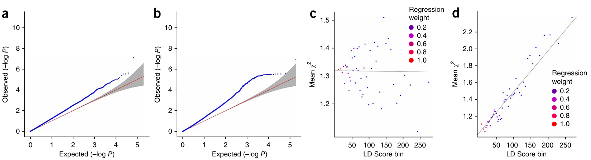

### 📄  LD Score regression distinguishes confounding from polygenicity in genome-wide association studies

**原文链接**: https://www.nature.com/articles/ng.3538 （DOI: 10.1038/ng.3538） \
**作者**: Brendan K. Bulik-Sullivan, Po-Ru Loh, Hilary K. Finucane, et al. \
**期刊**: *Nat Genet*, 2015 \
**关键词**: LD Score regression, confounding, polygenicity, GWAS inflation, intercept, heritability partitioning

---

## 🧠 一、研究背景

- 在 GWAS 中，常见的问题是 **检验统计量膨胀**（inflation）：即 χ² 或 p 值整体偏向显著。其可能原因包括 **真正的多基因信号** (polygenicity) 或 **混杂偏倚**（如人群分层、隐性亲缘关系、批次效应等）。
- 传统校正方法如 **genomic control (λ_GC)** 将整体检验统计量缩放，但这种方法不能区分：是因为真实信号（很多小效应）导致膨胀，还是因为偏倚所致。
- 所以作者提出 **LD Score regression** 方法，通过考察每个 SNP 的 LD Score（即该 SNP 标记的变异量）与其检验统计量的关系，来分离“信号引起的膨胀”与“偏倚引起的膨胀”。

---

## ⚙️ 二、方法原理（核心逻辑）
### 📏 1. 定义 LD Score

对于 SNP j，定义其 **LD Score** 为：

  

即 SNP j 与周边所有 SNP 的 r² 累加（在一定窗口内）。这个值反映 SNP j 标记或“覆盖”的遗传变异量。

### 📈 2. 期望 χ² 与 LD Score 的线性关系

在多基因模型假设下，可以推导出：

  

其中：
- $N$ 是样本量  
- $h^2$ 是总 SNP 遗传率  
- $M$ 是 SNP 数目  
- $a$ 是偏倚项（confounding bias contribution）  
- 1 表示无效假设时的基线  

这个线性模型说明：如果某个 SNP 标记很多变异 (高 LD Score)，它更可能 “搭载”一个或多个因果变异，因而其 χ² 值平均会更大。反之，偏倚（如人群结构）导致的膨胀与 LD Score 无关。

### 🧮 3. 线性回归与参数估计

- 用所有 SNP 的 χ² 值做回归（χ² 对 LD Score）：
  

    
  

  其中：
  - $\alpha$ 是 intercept（理论上 = 1 + a）  
  - $\beta$ 与 $N h^2 / M$ 相关  

- 从回归得到 $\alpha$（intercept）与 $\beta$：
  - $\alpha - 1$ 可被解释为 **偏倚 (confounding) 的膨胀贡献**  
  - $\beta$ 用来估计 SNP-解释的遗传率 (h²) 或变异解释率  

- 在回归中要注意异方差 (heteroskedasticity) 和 SNP 相关性（因为 SNP 不是独立的）。论文中使用加权回归、block-jackknife 等方法来调整标准误和控制相关性。

### 🧪 4. 区分信号 vs 偏倚

- 若膨胀主要是偏倚（如人群结构），那么 χ² 与 LD Score 无显著正相关，回归斜率小但 intercept 会偏高。  
- 若膨胀主要来自真正的多基因效应 (polygenic signal)，那么 χ² 与 LD Score 有正相关，斜率显著，intercept 较接近 1。  
- 因此，该方法可以“划分”膨胀的来源：估算出偏倚贡献 vs 遗传信号贡献。

---

## 📊 三、数据与实验设计

| 内容 | 描述 |
|---|---|
| **LD Score 估计** | 使用 1000 Genomes 欧洲人 (EUR) 数据，1 cM 窗口，无 r² 截断，排除单体 (MAF < 0.13%)  |
| **SNP 过滤与 QC** | 选出 MAF ≥ 1% 的 SNP，用以降低估计误差 |
| **模拟验证** | 在模拟不同情况（仅偏倚、仅多基因、混合场景）下测试方法的估计准确性与稳定性 |
| **真实 GWAS 应用** | 应用于多个真实 GWAS 结果（20+ 性状）以检验膨胀来源分配与校正效果 |

## 🧩 四、主要结果 / 结论

1. **多基因效应是膨胀主因**  
   在许多大规模 GWAS 中，LD Score regression 结果显示，大部分检验统计量膨胀来自 **真正的多基因信号**，而不是偏倚。
2. **Intercept < λ_GC**  
   相比于传统的 genomic control (λ_GC) 校正，LD Score regression 的 intercept 较 λ_GC 小，说明传统方法校正可能过于保守，降低功效。
3. **在多样 GWAS 上的应用效果**  
   对多个性状结果做回归，斜率显著，且 intercept 较接近 1，说明方法有效区分信号与偏倚。
4. **模拟结果验证**  
   在模拟中，对偏倚和多基因混合场景都能较好估计 intercept 与斜率，估计偏差小。

---

## 💬 五、个人理解与启发

- **LD Score regression 是 GWAS 方法学中的里程碑**：它给出了一个简洁有效的方式，用汇总统计数据（summary statistics）就能区分混杂偏倚和真正多基因信号，对 GWAS 校正、遗传率估计、下游分析（如注释富集）等都有广泛影响。  
- 在研究中：
  - 可以用 LD Score regression 校验 GWAS summary 的膨胀来源，看是信号还是偏倚占主导；
  - 在做 downstream 分析（如富集、注释、可视化）之前，用该方法调整或校正是一个好步骤；
  - 若未来做跨人群 GWAS，对比不同人群的 LD Score intercept 和斜率，可以理解各群体中偏倚 / 多基因信号的差异；
  - 此外，LD Score regression 后续还有很多扩展（如 Stratified LDSC, LDSC-SEG, S-LDSC 等），可以作为进一步工具链的一部分。

---

## 📚 六、参考引用

> Bulik-Sullivan, B. K., Loh, P. R., et al (2015). *LD Score regression distinguishes confounding from polygenicity in genome-wide association studies*. *Nature Genetics*, 47(3), 291–295. DOI: 10.1038/ng.3211

---

*最后更新：2025-10-17*
