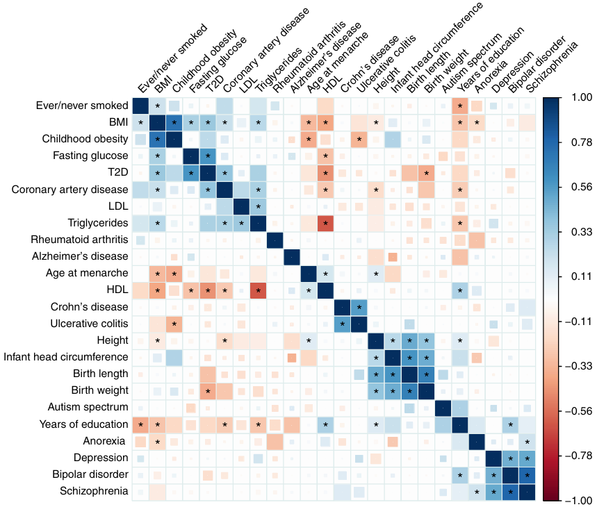

### 📄  An atlas of genetic correlations across human diseases and traits

**原文链接**: https://www.nature.com/articles/ng.3406 （DOI: 10.1038/ng.3406） 
**作者**: Brendan Bulik-Sullivan, Hilary K. Finucane, Verneri Anttila, et al. 
**期刊**: *Nat Genet*, 2015
**关键词**: cross-trait genetic correlation, LD Score regression, summary statistics, sample overlap correction, trait architecture

---

## 🧠 一、研究背景

- 复杂性状 / 疾病之间存在遗传相关性（genetic correlation）——即一些遗传变异同时影响多个性状或疾病。理解这些相关性有助于揭示共同的生物机制、鉴别共病风险和反向因果关系。
- 传统估计遗传相关性的方法常依赖个体水平的基因型数据 (例如 GREML 联合模型)，但很多 GWAS 只公开 summary statistics，而且存在样本重叠（sample overlap），这会引入偏倚。
- 本文提出 **cross-trait LD Score regression**（跨性状 LD Score 回归）的方法，用于在仅有 summary-level 数据的条件下，估计不同性状 / 疾病之间的遗传相关性，同时校正样本重叠的偏倚。

---

## ⚙️ 二、方法原理（核心逻辑）
### 📏 1. 单性状 LD Score 回归回顾

- 单一性状的 LD Score 回归模型是假设：
  $$
  \mathbb{E}[\chi_j^2] = 1 + \frac{N \, h^2}{M} \times \mathrm{LDScore}(j) + \text{confounding}
  $$
  其中 $\mathrm{LDScore}(j)$ 是 SNP j 的 LD Score 值（累加与其周围 SNP 的 $r^2$）。

- 这种方法可以区分检验统计膨胀 (inflation) 来自真实遗传信号 vs 偏倚 (如人群结构) 的部分。

### 🔄 2. 跨性状 LD Score 回归（cross-trait LDSC）

为了估计两个性状 $A$ 和 $B$ 的遗传相关性 $r_g$，作者扩展了 LD Score 回归：

- 定义每个 SNP j 的 z 统计量：$z_{jA}$ 对应性状 $A$，$z_{jB}$ 对应性状 $B$。

- 在模型假设下，有如下期望关系（简化形式）：
  $$
  \mathbb{E}[z_{jA} z_{jB}] = \frac{\sqrt{N_A N_B}}{M} \, r_g \, h_{A} h_{B} \, \mathrm{LDScore}(j) + \text{bias term}
  $$
  其中：
  - $N_A, N_B$：两个 GWAS 的样本量  
  - $h_A, h_B$：各性状的 SNP 遗传率  
  - $r_g$：遗传相关系数  
  - “bias term” 用以捕捉样本重叠 (sample overlap) 或协变量共混的影响

- 因此，可对 $z_{jA} z_{jB}$ 与 $\mathrm{LDScore}(j)$ 做回归：
  $$
  z_{jA} z_{jB} = \alpha + \beta \, \mathrm{LDScore}(j) + \varepsilon_j
  $$
  其中 $\beta$ 与 $r_g$ 有线性对应关系，$\alpha$ 捕捉偏倚 / 样本重叠贡献。这样就能估计 $r_g$ 而控制偏倚因素。 

- 作者还证明该方法在样本重叠下仍不偏倚（bias-robust），因为样本重叠会对 intercept（$\alpha$）造成上移，但不会扭曲斜率估计。

### 🧪 3. 统计推断与标准误校正

- 在回归中使用加权最小二乘 (weighted least squares) 来控制 SNP 之间的异方差性 (heteroskedasticity)。  
- 用 block-jackknife 或分块法估计斜率标准误 (standard error) 以控制 SNP 间相关性。  
- 对多个性状对执行回归，得到一个遗传相关性矩阵 (genetic correlation matrix)

---

## 📊 三、数据与实验设计

| 模块 | 描述 |
|---|---|
| GWAS summary 数据 | 本文收集了 24 个性状 / 疾病的 GWAS summary statistics，样本量范围较大。 |
| LD Score 计算 | 使用欧洲人 (1000 Genomes) 数据计算 SNP 的 LD Score 作为基准。|
| 模型回归 | 对每一对性状做 cross-trait 回归，估计遗传相关性 (r_g) 和偏倚项 (intercept) |
| 验证 / 应用 | 构建 “遗传相关性图谱 (atlas)”——共估计 276 对性状之间的遗传相关性，并报告其统计显著性和生物学解释。|

## 🧩 四、主要结果 / 结论

1. **广泛的遗传相关性**  
   作者估计了 24 个性状之间的 276 对遗传相关性，发现许多意料之外的相关性对，例如神经精神疾病、代谢性疾病与教育年限 / 肥胖等性状间存在显著相关性。
2. **样本重叠的偏倚校正能力**  
   作者演示 cross-trait LDSC 在存在样本重叠的情况下仍能无偏地估计遗传相关性，因为重叠效应主要体现在 intercept，而不会影响斜率。
3. **相关性图谱可用于疾病 / 性状机制探索**  
   例如，作者报告了厌食症 (anorexia nervosa) 与精神分裂症 (schizophrenia) 之间的遗传相关性，以及教育年限与多种疾病 /性状之间的负相关性。
4. **方法的可扩展性与实用性**  
   该方法对 summary statistics 要求较低（不需个体-level 数据），计算效率高，适合用于大规模性状关联研究。  
5. **贡献一个公共资源**  
   作者将估计结果做成遗传相关性图谱供社区使用，促进后续跨性状 / 共病研究。 

---

## 💬 五、个人理解与启发

- **cross-trait LD Score regression** 是理解多个性状 / 疾病之间遗传共享的关键工具，它补足了仅看单一性状的方法视角。  
- 在研究中，如果有多个相关性状（如代谢性状、精神疾病表型、认知 / 行为特征等），可以用这个方法来构建遗传相关性网络，看哪些性状共享遗传架构。  
- 在做 GWAS summary-level 分析前，可以先做 cross-trait LDSC 检验性状之间的遗传相关性，以判断是否有共因路径或共同基因机制。  
- 这个方法与 SMR / TWAS / colocalization 等可以组合使用：例如先识别有高遗传相关性的性状对，再在那些对之间做基因优先化 / 共享信号挖掘。  
- 注意：该方法对 LD 模型、样本结构、注释选择、GWAS 质量、SNP 筛选等敏感，应谨慎 QC 和参数选择。

---

## 📚 六、参考引用

> Bulik-Sullivan, B., Finucane, H. K., Anttila, V., et al (2015). *An atlas of genetic correlations across human diseases and traits.* *Nature Genetics*, 47(11), 1236–1241. DOI:10.1038/ng.3406

---

*最后更新：2025-10-17*
