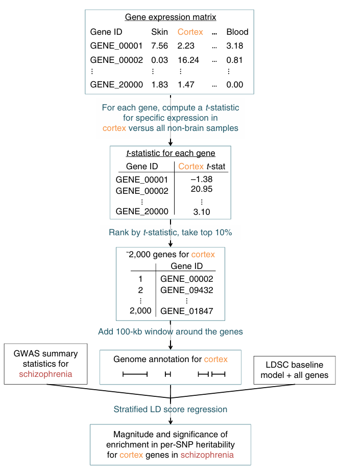

### 📄  Heritability enrichment of specifically expressed genes identifies disease-relevant tissues and cell types

**原文链接**: https://www.nature.com/articles/s41588-018-0081-4 （DOI: 10.1038/s41588-018-0081-4） \
**作者**: Hilary K. Finucane, Yakir A. Reshef, Verneri Anttila, et al. \
**期刊**: *Nat Genet*, 2018 \
**关键词**: specifically expressed genes, heritability enrichment, stratified LD Score regression, tissue / cell type prioritization, GWAS summary statistics

---

## 🧠 一、研究背景

- 虽然我们已经有方法（如分层 LDSC / LDSC-SEG）可以估计不同功能注释类别在总体 GWAS 遗传率中的富集，但这些方法通常对注释是“区域 / 功能”层面（如 enhancer, promoter, 染色体修饰）且较粗粒度。  
- 另一方面，基因表达数据（尤其跨组织 / 细胞类型的特异表达）提供了组织 / 细胞特异性调控信息。如果能把“哪些基因在某个组织 / 细胞中特异表达”这一信息与 GWAS 遗传率富集模型结合，就可以更精细地识别与性状相关的组织 / 细胞类型。  
- 本文提出的方法是，将**特异表达 (specifically expressed genes, SEG)** 与 stratified LD Score regression 联合使用，测试那些在某个组织 / 细胞中特异表达的基因周边区域其 SNP 是否对性状遗传率有富集。这样可以在组织 / 细胞水平优先识别“相关类型”。
- 作者在 48 个疾病 / 性状上应用此方法，证明它能复现已知组织 / 细胞–性状关联，并在多个性状中发现新的组织 / 细胞特异富集。

---

## ⚙️ 二、方法原理（核心逻辑）
### 🧩 1. “特异表达基因 (SEG)” 注释构建

- 对每个组织 / 细胞类型，利用表达数据（如 GTEx、其他跨组织 / 细胞表达矩阵）对所有基因计算其在该组织 / 细胞中相对于其他组织 / 细胞的表达差异 / 特异性得分（如 t-statistic、Z-score 等）。
- 选取 **排名前 10% 的特异表达基因** 作为该组织 / 细胞的 SEG 集合。然后，在这些基因的上下游（例如 ±100 kb 窗口）扩展注释区域，构建 SNP 注释。
- 这就为每个组织 / 细胞类型定义了一个 “基因邻近注释集合 (annotation)”：即那些靠近在该组织中特异表达基因的 SNP。  

### 📊 2. 将 SEG 注释纳入分层 LD Score 回归框架

- 使用 **Stratified LD Score Regression (S-LDSC)** 的框架，将 SEG 注释作为一个注释类别（annotation category）加入回归模型。  
- 回归假设类似于标准 S-LDSC，即每个 SNP 的效应方差是各注释类别加权贡献的和。于是其预期 χ² 值可以表示为这些注释类别下的 LD Score 加权和 + 偏倚项。  
- 在回归中，控制基线模型（baseline annotations, baseline LD model）以及所有基因附近的注释，以避免混淆和偏倚。通过这种方式，SEG 注释是否显著富集（coefficient / τ 参数显著）即表明该组织 / 细胞类型对应的 SNP 在遗传率中有“额外贡献”。  

### 🧪 3. 统计推断与校正

- 使用加权最小二乘 (weighted regression) 控制各 SNP 的方差异质性 (heteroskedasticity)。  
- 用 block-jackknife 方法估计标准误 (standard error)，以控制 SNP 间 LD 相关性对估计的不利影响。  
- 多重检验校正采用 FDR 控制，确定在多个组织 / 细胞 annotation 中显著富集 (FDR < 5%) 的那些类型作为“关联类型”。  

---

## 📊 三、数据与实验设计

| 模块 | 描述 |
|---|---|
| **GWAS summary 数据** | 48 个不同性状 / 疾病的 summary statistics，平均样本量 ~169,331 人次 |
| **表达 / 注释数据** | 越多组织 / 细胞类型表达数据（GTEx、其他跨组织表达集）用于计算 SEG 集合 |
| **基线注释 / 控制组合** | 在分层回归中还同时包含 baseline 注释模型（例如传统功能注释、LD 基线模型等）以控制混杂效应 |
| **验证 / 比较** | 与染色质 / 表观注释（如 Roadmap / ENCODE chromatin 数据）对比验证 SEG 注释富集结果的一致性 |

## 🧩 四、主要结果 / 结论

1. **广泛的组织 / 细胞特异性富集**  
   在 48 个性状 / 疾病中，有 34 个显示至少一个组织 / 细胞类型的 SEG 注释富集通过 FDR < 5%。即不少性状可以“定位”到特定组织 / 细胞类型。
2. **复现生物学已知关联**  
   方法识别出的组织 / 细胞类型中，很多是与性状已知相关的（如神经系统、免疫系统等）—说明方法具有生物合理性。 
3. **脑 / 神经系统内部差异**  
   在脑相关性状中，作者观察到对双相障碍 (bipolar disorder)，抑制性神经元 (inhibitory neurons) 相对于兴奋性神经元 (excitatory neurons) 的富集；而在精神分裂症 (schizophrenia) 与 BMI 中，则兴奋性神经元有较高富集。 
4. **使用染色质注释验证**  
   作者用 Roadmap / ENCODE chromatin 数据进一步验证了 SEG 注释富集的可靠性，增强了注释与遗传信号之间的连接可信度。 

---

## 💬 五、个人理解与启发

- 这篇文章把 **基因表达的组织 / 细胞特异性** 注释有机地与遗传率富集模型结合起来，是从“功能 / 区域注释”向“类型 / 细胞注释”过渡的典范。  
- 如果已经有不同组织 / 细胞类型的表达数据，可以尝试构建 SEG 注释并用这个方法看看GWAS 性状在那些类型中有富集。  
- 这种思路也容易与后续方法结合：例如在单细胞背景下，可以把某个细胞群体中特异表达基因作为 SEG 注释，然后纳入类似模型做富集。
- 在实践中要注意：表达数据的质量 / 样本代表性、SEG 基因选择阈值、注释窗口设计、基线注释模型设置等都会影响结果的稳定性。

---

## 📚 六、参考引用

> Finucane, H. K., Reshef, Y. A., Anttila, V., et al (2018). *Heritability enrichment of specifically expressed genes identifies disease-relevant tissues and cell types*. *Nature Genetics*, 50(4), 621–629. DOI: 10.1038/s41588-018-0081-4

---

*最后更新：2025-10-17*
