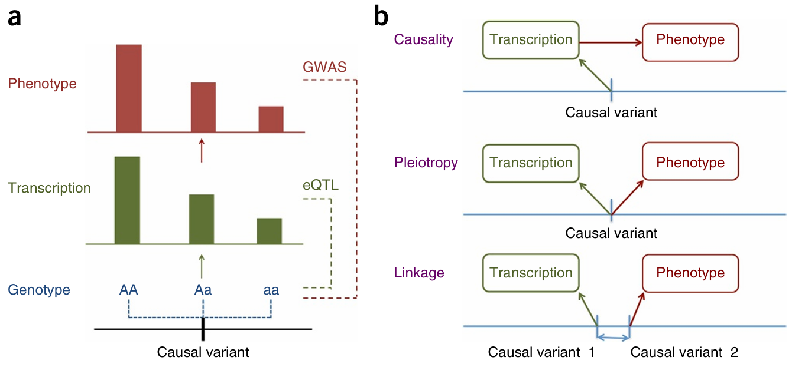

### 📄  Integration of summary data from GWAS and eQTL studies predicts complex trait gene targets

**原文链接**: https://www.nature.com/articles/ng.3538 （DOI: 10.1038/ng.3538） 
**作者**: Zhihong Zhu, Futao Zhang, Han Hu,  et al. 
**期刊**: *Nat Genet*, 2016 
**关键词**: GWAS, eQTL, SMR, HEIDI, summary-level integration, gene prioritization, pleiotropy

---

## 🧠 一、研究背景

- 虽然 GWAS 已经鉴定出很多与复杂性状相关的 SNP 变异，但这些变异“通过哪个基因 /哪个调控机制”起作用往往不清楚。
- 同时，许多 eQTL 研究揭示了基因表达 – 基因型关联（即某些基因受 SNP 调控表达水平），但从 eQTL 本身并不能直接说明这些表达变化是否影响复杂性状。
- 将 GWAS 与 eQTL 整合、用 summary-level 数据（即公开的 GWAS summary statistics 和 eQTL summary 结果）来推断哪几个基因最有可能是“中介 / 功能基因”是一个非常有吸引力的方向。
- 本文提出一种叫 **SMR**（Summary-data-based Mendelian Randomization）的方法，以及辅助的 **HEIDI** 检验，以在 summary 层面筛选、验证基因 – 性状关联的“共因 (pleiotropy)”关系。

---

## ⚙️ 二、方法原理（核心逻辑）

### 🧩 1. 基本假设与因果路径

假设存在以下路径关系：

$$
SNP (Z) → 基因表达 (X) → 性状 (Y)
$$

如果同一遗传变异 Z 同时影响表达和性状（即共因效应），则可以通过 **工具变量分析（Mendelian Randomization, MR）** 推断 “X → Y” 的因果效应。

在 summary 层面，SMR 利用以下两类公开结果：

- eQTL summary: SNP 对表达的效应估计 (β_ZX)
- GWAS summary: SNP 对性状的效应估计 (β_ZY)

### 🧮 2. SMR 统计量计算

SMR 的核心思想是：
若 SNP Z 既是 eQTL 又与性状相关，则可以估计出表达 (X) 对性状 (Y) 的因果效应：

$$
\hat{b}_{XY} = \frac{\hat{b}_{ZY}}{\hat{b}_{ZX}}
$$

其中：

- $\hat{b}_{ZX}$：SNP 对表达的效应（来自 eQTL）
- $\hat{b}_{ZY}$：SNP 对性状的效应（来自 GWAS）

假设同一个 SNP 驱动两个效应，上式即为 MR 估计。

在实际操作中：

- 选取每个基因的 **top cis-eQTL** 作为该基因的工具变量；
- 用该 SNP 在 GWAS summary 中的效应估计代入；
- 对所有基因计算对应的 SMR 统计量；
- 进行显著性检验，p 值越小说明该基因表达与性状的关联越强。

SMR 检验统计量为：

$$
T_{SMR} = \frac{\hat{b}_{XY}^2}{Var(\hat{b}_{XY})}
$$

其 p 值可近似服从卡方分布（df=1）。

### 🧪 3. HEIDI 检验原理

**问题：** SMR 显著关联 ≠ 真因果。
可能存在另一种情形：两个不同的 SNP (Z₁, Z₂) 在连锁不平衡 (LD) 中，分别影响表达与性状，导致假象共因。

因此需要 HEIDI（Heterogeneity in Dependent Instruments）来区分这两种情况：

| 情形                  | 描述                                | HEIDI 结果                                                                          |
| --------------------- | ----------------------------------- | ----------------------------------------------------------------------------------- |
| 真实共因 (pleiotropy) | 同一个因果 SNP 同时影响表达与性状   | 区域内多个SNP 的$\frac{β_{ZY}}{β_{ZX}}$比值一致 → 无异质性（*p_HEIDI* > 0.05） |
| 连锁混杂 (linkage)    | 不同 SNP 通过 LD 分别影响表达与性状 | 不同 SNP 的比值差异大 → 有异质性（p_HEIDI < 0.05）                                 |

HEIDI 通过拟合所有在 cis 区域内与 top SNP LD>0.05 的 SNP，检验这些 SNP 的比值一致性。
若出现显著异质性，则拒绝“同一因果变异”假设，该基因被排除。

---

## 🧩 三、主要结果 / 结论

1. **优先基因筛选**在多个复杂性状中，作者用 SMR + HEIDI 方法优先筛出 126 个基因作为可能的功能基因（即这些基因的表达水平可能中介了 SNP → trait 的效应）。其中有若干基因并不在 SNP 最近邻位置，提示远距离调控可能作用。
2. **新的候选基因**在这些 126 个基因中，25 个是此前未被认为与性状相关的候选基因；还有 77 个基因不是位于关联 SNP 最近基因位置，展示了传统最近基因注释方法的局限性。
3. **实例验证 / 典型 locus 分析**

   - 以类风湿关节炎 (RA) 的 **TRAF1–C5** 区域为例，作者通过 SMR / HEIDI 分析确认 TRAF1 是一个优先基因，而不仅仅是最近基因。
   - 以精神分裂症 (schizophrenia) 中的 **SNX19 / NMRAL1** 位点为例，作者表明某些 eQTL 信号与 GWAS 关联可能共因或有重叠作用。
4. **方法平台效能 / 适用性**SMR 方法在 summary 层面运行效率较高，适合大规模 GWAS + eQTL 整合。作者通过模拟 / 实证分析表明，在样本量、LD 结构、效应异质性存在的情况下，SMR + HEIDI 的筛选结果有一定稳健性。
5. **对未来功能验证的启示**
   这些优先基因为后续实验验证提供了目标候选，能够引导功能研究进一步确定 SNP → 基因 → 性状的因果链。

---

## 💬 四、个人理解与启发

- **SMR + HEIDI 是“summary-level 基因优先化”方法的奠基之作**，为后续 TWAS、colocalization 等系列方法（如 FUSION、COLOC、eCAVIAR）提供理论基础。  
- 与 TWAS 相比，SMR 的优势是模型简洁、可解释性强；但假设更严格（单一因果变异）。  
- 在我的研究中，如果目标是：
  - 用 GWAS + eQTL summary 快速定位候选基因；
  - 或探索多组织表达对性状的贡献；  
  可以首选 SMR + HEIDI 作为起点，再结合 COLOC / TWAS / fine-mapping 做验证。  
- 若数据来自单细胞或组织特异背景，可将 SMR 扩展到 sc-eQTL 层面，检测 **细胞状态依赖的基因–性状关系**。

---

## 📚 五、参考引用

> Zhu, Z., Zhang, F., Hu, H., Bakshi, A., Robinson, M. R., Powell, J. E., Montgomery, G. W., Goddard, M. E., Wray, N. R., Visscher, P. M., & Yang, J. (2016). *Integration of summary data from GWAS and eQTL studies predicts complex trait gene targets*. *Nature Genetics*, 48(5), 481–487. DOI: 10.1038/ng.3538

---

*最后更新：2025-10-17*
