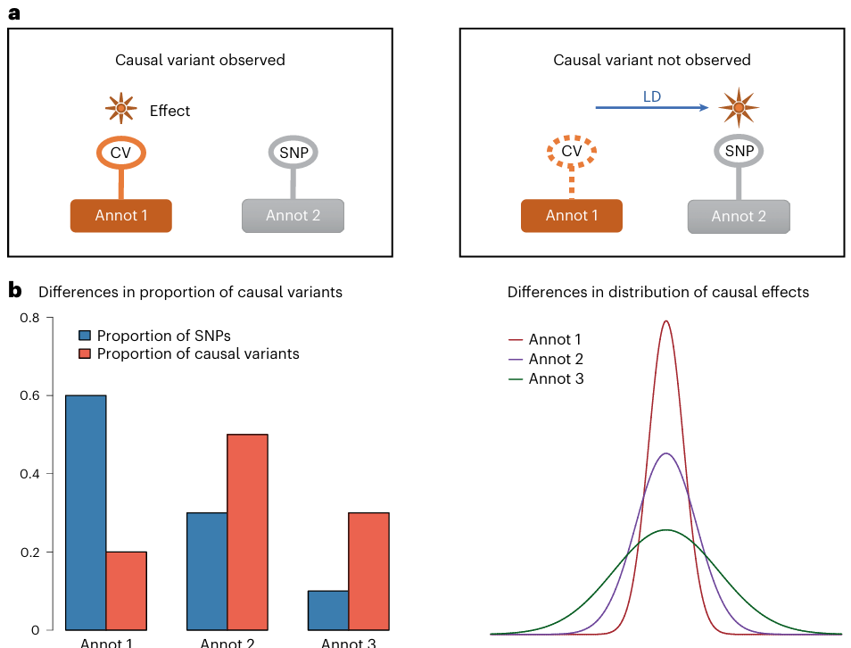

### 📄  Leveraging functional genomic annotations and genome coverage to improve polygenic prediction of complex traits within and between ancestries

**原文链接**: https://www.nature.com/articles/s41588-024-01704-y （DOI: 10.1038/s41588-024-01704-y） 
**作者**: Zhili Zheng, Shouye Liu, Julia Sidorenko, et al. 
**期刊**: *Nat Genet*, 2024
**关键词**: polygenic prediction, functional genomic annotation, cross-ancestry prediction, Bayesian multiple regression, SNP density, annotation interaction

---

## 🧠 一、研究背景

- 在基因组领域，**多基因预测（polygenic prediction／polygenic risk score, PRS）** 被广泛用于预测复杂性状或疾病风险。但目前许多方法依赖于 GWAS summary statistics 而忽略了功能基因组注释信息，这可能降低预测性能。 
- 此外，多数 PRS 方法在本族群（如欧洲人群）中表现较好，但在跨族群（跨人群 / 不同祖源）中的预测精度往往显著下降。作者希望通过整合功能注释和更全面的基因组覆盖（更多 SNP）来**提升跨人群和本族群内的预测能力**。
- 为此，作者提出一个新方法 **SBayesRC**，用于把 GWAS summary statistics 与功能注释整合起来，以改进复杂性状的 polygenic prediction。

---

## 🔬 二、研究方法

| 模块 | 方法 / 思路 | 说明 / 创新点 |
|---|----------------------|-------------------------|
| 模型框架：SBayesRC | 在 Bayesian 多重回归（Bayesian multiple regression）框架内，将 SNP 的功能注释纳入模型，使注释既能影响某 SNP 是不是因果变异（causal probability），也能影响其效应大小分布 | 这种双重调节方式比仅把注释作为权重或先验更灵活、表达能力更强 |
| 全基因组覆盖 / SNP 数量扩展 | 使用约 7 百万 (7M) 常见 SNP，而不是局限于少数 SNP 子集 | 扩大 SNP 覆盖率可以捕获更多变异信息，提升预测能力 |
| 注释集合与特征 | 使用 96 种功能注释（如保守性区域、编码变异、染色质标记、调控元件注释等） | 多样注释帮助模型区分不同 SNP 的潜在效应机制 |
| 模型优化 / 低秩近似 | 作者设计了低秩近似 (low-rank) 模型结构来降低计算复杂度，使得在大 SNP 数量和注释数量下仍可高效运行 | 在实际应用中可减少内存和计算压力 |
| 注释 × SNP 密度 交互 | 探讨 SNP 密度（coverage）和注释信息之间的交互作用：较高密度 + 注释可能带来额外提升 | 这一交互性分析揭示了在高密度 SNP 条件下注释信息更有用的一面 |
| 性能评估 / 比较 | 与多个已有方法比较（包括 SBayesR（不使用注释）、LDpred2、LDpred-funct、MegaPRS、PolyPred-S、PRS-CSx 等） | 在多个复杂性状 / 疾病上做交叉验证 / 验证集测试 |  
| 功能分区 / 注释贡献分析 | 对模型所得的 SNP 效应 / 贡献进行功能分区分析，识别哪些注释类别（例如进化保守区域、非同义 SNP 等）对预测提升贡献较大 | 帮助理解注释机制背后的生物学意义 |

在方法部分，作者还在 Supplementary / 方法中提供了完整数学模型推导、MCMC / Gibbs 采样细节、注释参数估计方案、低秩近似实现、模型稳健性检验等。

---

## 🧩 三、主要结果 / 结论

1. **SBayesRC 显著提升预测精度**  
   与基线方法 SBayesR（不使用注释）相比，在欧洲人群内部预测中平均提升约 14%；在跨人群 / 跨祖源预测中提升可达 34%。 
2. **在各种方法中具备竞争力 / 优越性**  
   相对于 LDpred2、LDpred-funct、MegaPRS、PolyPred-S、PRS-CSx 等方法，SBayesRC 在多个复杂性状 / 疾病上的表现常常优于或不逊色。
3. **注释 × SNP 密度交互效应**  
   注释信息的效益在 SNP 覆盖率高的情况下更显著：即当 SNP 数量更多、更密集时，功能注释能带来更大提升。 
4. **功能注释类别的贡献差异**  
   在功能分区分析中，进化保守 (evolutionarily constrained) 区域对预测精度的贡献很大；此外，**非同义 (nonsynonymous) SNP** 在每个 SNP 的平均贡献上比其他类别更高。
5. **模型资源 / 计算效率表现**  
   该模型在实际使用中可行：对 7M SNP + 96 注释的模拟 / 实验，所需资源和运行时间在可接受范围内。
6. **生物学 / 方法意义**  
   这篇工作表明，把功能注释纳入多 SNP 回归模型中，并扩展 SNP 覆盖率，是提升 polygenic prediction 的有效路径，尤其是在跨祖源或高密度 SNP 条件下。它还为未来结合全基因组测序 (whole-genome sequence) 数据 + 注释的预测方法提供了前瞻性思路。

---

## 💬 四、个人理解与启发

- 这篇文章是当前多基因预测领域一个非常有力的进展：它不仅在模型上更灵活（注释影响概率 + 效应大小），还在 SNP 密度层面做了扩展，从而提升跨人群预测能力。  
- 如果研究涉及PRS（尤其跨族群 / 多样本混合群体），可以考虑把类似 SBayesRC 的策略纳入模型设计中。  
- 尤其值得注意的是 **注释 × SNP 密度交互** 这个因素：说明如果你未来能拿到高密度 / 全基因组变异数据，那么注释信息将带来更大边际收益。  
- 在功能注释层面，这篇文章的分区分析也提醒，在选择注释集 / 特征时，可以优先考虑保守区域 / 非同义变异这类具有较强效应潜力的类别。  
- 若将来能整合更多类型注释（如表观遗传、3D 结构、细胞类型特异注释等）进入类似框架，有可能进一步提升预测性能。

---

## 📚 五、参考引用

> Zheng, Z., Liu, S., Sidorenko, J., et al. (2024). *Leveraging functional genomic annotations and genome coverage to improve polygenic prediction of complex traits within and between ancestries*. *Nature Genetics*, 56(5), 767–777. DOI: 10.1038/s41588-024-01704-y 

---

*最后更新：2025-10-17*
