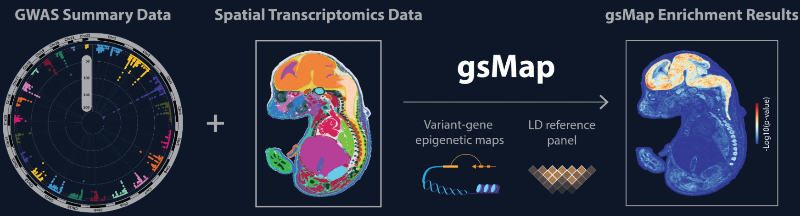

### 📄  Spatially resolved mapping of cells associated with human complex traits

**原文链接**: https://www.nature.com/articles/s41586-025-08757-x （DOI: 10.1038/s41586-025-08757-x） \
**作者**: Liyang Song, Wenhao Chen, Junren Hou, Minmin Guo, Jian Yang  \
**期刊**: *Nature*, 2025 \
**关键词**: spatial transcriptomics, GWAS, trait-cell mapping, GNN, gene specificity score, heritability enrichment

---

## 🧠 一、研究背景

- 虽然已有在 *scRNA-seq* 层面将 GWAS 信号映射到细胞类型的方法，但这些方法往往**缺乏空间定位信息**，即不能告诉我们这些与性状或疾病相关的细胞在组织中的空间分布。
- 空间转录组 (spatial transcriptomics, ST) 能在组织原位测定基因表达并保留空间坐标，是探索组织组织结构、细胞异质性和空间模式的关键技术平台。
- 但 ST 数据通常存在噪声大、表达稀疏、空间分辨率不够精细等问题；而将 GWAS 信号整合到 ST 中以映射 trait-relevant 细胞时，还面临如何判定哪些空间胞点（或 spot / 聚类）与性状相关的问题。
- 本文提出了一种新方法 **gsMap**（genetically informed spatial mapping of cells），将 GWAS summary statistics 与空间转录组数据结合，以期在空间上识别与性状 / 疾病相关的细胞或区域。

---

## ⚙️ 二、方法原理（核心逻辑）

### 🧩 1. 整体思想
gsMap 的核心目标是：  
> 利用 `GWAS heritability partition` 思路，将每个空间点 (spot) 的转录特征转化为基因集特征，再通过 LDSC 测试其与性状遗传力的富集程度，从而在空间层面上描绘“trait-relevant” 细胞区域。

### 🧠 2. 模型原理分层解释

#### (1) 空间表示学习 — GNN 构建微域结构
- 输入为 ST 的基因表达矩阵与空间坐标。  
- 使用 **图神经网络 (Graph Neural Network, GNN)** 将相邻 spots 的表达与空间位置信息整合，得到每个 spot 的低维 embedding 表征。  
- 然后基于 embedding 的相似性聚类形成**空间微域 (microdomain)**，即局部组织结构单元。

> 这一步的数学表示为： 
> 

>   
> 
  

> 其中：  
> - $\mathbf{X}$：原始表达矩阵  
> - $\mathbf{A}$：空间邻接矩阵  
> - $\mathbf{H}$：GNN 输出的 spot embedding

#### (2) 基因特异性得分 (Gene Specificity Score, GSS)
在每个微域中，对基因在该域的相对表达强度进行排名，计算其“空间特异性”：

   

  

即某基因在某 spot（或微域）的表达是否显著高于全局背景。

这使得每个 spot 拥有一个基因特异性谱 (GSS profile)，反映其空间功能特征。

#### (3) 从 GSS 到 SNP 注释
- 将基因特异性分数 $GSS_{g,s}$ 映射到与基因相关的 SNP 区间（如 ±50 kb），得到“spot-specific SNP annotation”。  
- 即每个空间点对应一个功能 SNP 集，代表该空间区域的遗传特征。

#### (4) 分层遗传力富集（S-LDSC）
- 对每个 spot，对应的 SNP 注释集输入分层 LDSC (Stratified LD Score Regression)： 

   

  

其中：
- $h^2_s$：该性状在该 spot 上的遗传力解释度；
- $\alpha_1$：注释富集系数。

- 显著的 $\alpha_1 > 0$ 表明该空间点的 SNP 特征与性状遗传信号富集相关。

#### (5) 空间区域整合
- 为避免孤立点噪声，使用 **Cauchy 组合检验** 将相邻 spots 的富集 p 值合并为区域水平显著性；
- 形成连续的“trait-associated spatial domains”。

## 📊 三、数据与实验设计

| 模块 | 描述 |
|------|------|
| **输入 GWAS 数据** | 多个复杂性状（精神分裂症、抑郁症、认知能力、身高、BMI 等） |
| **ST 数据** | 主要使用人脑（前额叶皮层、海马体）、人类胚胎以及部分小鼠组织空间转录组 |
| **基线注释与比较** | 与传统的 scDRS、CELLECT、LDSC-SEG 方法对比 |
| **性能评估** | 模拟数据验证 FDR 控制；真实数据验证空间显著性一致性与生物学可解释性 |                                         |

---

## 🧩 四、主要结果 / 结论

1. **gsMap 方法在模拟与真实数据上的性能良好**在原假设场景中，gsMap 对空 spot 的误检率较低，FDR 可控。作者用已知 trait-组织 / 细胞关系作为“正例”验证了 gsMap 的识别能力。
2. **在胚胎空间转录组中成功将多个性状映射至器官 / 组织层面**作者将人类 GWAS 性状映射到小鼠 / 胚胎 spatial 数据（跨物种应用）来识别组织–性状关联关系，结果与已知结果有一定一致性。
3. **在人体大脑 ST 数据中探索多个脑相关性状的空间定位**

   - 对 **精神分裂症 (schizophrenia)** 关联的 glutamatergic 神经元 (Glu-neurons)，其空间分布更接近于认知类性状而非情绪 / 抑郁类性状。
   - 这些 schizophrenia 相关的 Glu-neurons 更多分布于 dorsal hippocampus 区域，并富含钙信号 / 调节通路相关基因表达。
   - 相比之下，抑郁症 (depression) 关联的 Glu-neurons 更偏向 deep medial prefrontal cortex 区域，且其上调的基因更偏重于神经可塑性 (neuroplasticity) 和精神药物靶点基因。
   - 由此，作者揭示：相同细胞类型（如 Glu-neurons）在不同精神 / 神经性状下，可能在空间定位和功能基因表达上存在差异，这为理解精神 / 神经疾病的异质性提供了空间维度视角。
4. **方法与生物意义扩展**

   - 该研究展示了将 GWAS 信号与空间转录组结合起来的潜力，能在**组织空间结构层面**识别 trait-relevant 细胞分布图。
   - 通过这种空间映射，可以更精细地将 GWAS-关联变异 / 关联基因注释到具体空间位置，从而为后续功能验证、定位靶点干预提供指导。
   - 作者还在公开平台 (gsMap 网站) 提供了可视化工具，以便社区探索各个性状在空间上的映射结果。

---

## 💬 四、个人理解与启发

- 这篇文章是近年来空间基因组学和遗传流行病学融合的一个标志性成果 —— 它将“谁是性状相关细胞”这一问题提升到“这些细胞在组织中哪里”的层面，加入空间维度极具价值。
- 在实验室应注意：空间数据噪声、分辨率、批次效应、表达稀疏性、SNP–基因映射策略等因素都可能影响结果的稳定性。
- 此外，可以思考将 gsMap 与其他方法（如基于 scRNA-seq 的 trait-cell mapping、TWAS / colocalization 方法等）做比较，看看在空间可解释性、分辨率、稳定性上的优劣。
- 如果将来有结合空间转录 + 空间表观 + 单细胞 + GWAS 的项目，说不定可以把 gsMap 扩展、改进（例如增加表观注释层、细胞–细胞交互层的空间约束模型等）作为方向。

---

## 📚 五、参考引用

> Song, L., Chen, W., Hou, J., Guo, M., & Yang, J., *et al.* (2025). *Spatially resolved mapping of cells associated with human complex traits.* *Nature*, 641(8064): 932-941. DOI: 10.1038/s41586-025-08757-x

---

*最后更新：2025-10-17*
