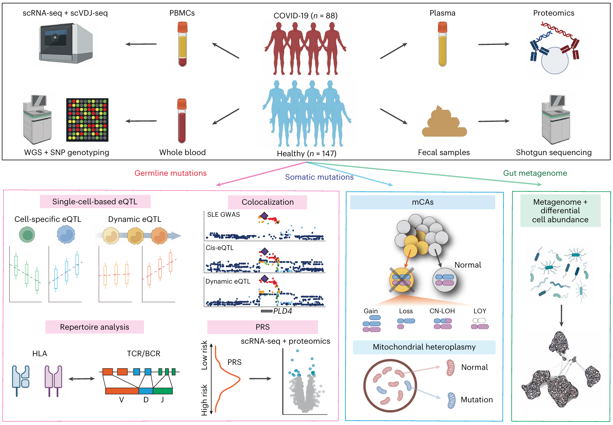

### 📄 New approaches to population stratification in genome-wide association studies
**原文链接**: https://www.nature.com/articles/s41588-025-02266-3 (DOI: 10.1038/s41588-025-02266-3) \
**作者**: Ryuya Edahiro, Go Sato, Tatsuhiko Naito, Yuya Shirai, et al.  \
**期刊**: *Nat Genet*, 2025 \
**关键词**: single-cell, multi-omics, eQTL, dynamic genetic regulation, somatic mutations, immune cell atlas  

---

## 🧠 一、研究背景

- 虽然已有许多人作了 bulk 组织层面的分子性状 QTL（molQTL） 分析，例如基因表达 (eQTL)、蛋白质水平 (pQTL)、代谢物水平 (metQTL) 等，但这种 bulk 分辨率掩盖了细胞类型/细胞状态之间的异质性。
- 在免疫系统中，不同细胞类型在不同刺激状态下可能具有截然不同的表达调控机制；此外，遗传变异（germline variants）对基因表达的调控可能存在“状态依赖性”（cell-state dependent）效应。本文旨在将多层组学整合到单细胞分辨率层面，构建免疫细胞图谱，探索遗传调控、表型关联与体细胞变异（somatic mutations）在单细胞层面的作用机制。
- 此外，目前主流的单细胞 eQTL 研究多集中于欧洲人群，本研究在日本人群中实施，有助于增加在东亚人群中的基因调控资源。

---

## 🔬 二、研究方法（综述中讨论的方法）

以下为本文使用的主要策略与技术要点：

 模块 / 分析方向 | 方法 / 技术策略 | 备注 / 创新点 |
|---|--------------------|-------------------|
| 样本与细胞图谱构建 | 从 235 名日本人（包括 COVID-19 患者与健康人）获取 PBMC（外周血单核细胞），进行单细胞转录组测序（scRNA-seq） > 1,500,000 细胞，覆盖多个免疫细胞类型和刺激状态。 | 相当大规模样本 + 高细胞数 / 细胞状态覆盖 |
| 多组学整合 | 将单细胞转录组数据与宿主基因组（germline SNP / WGS 数据）、血浆蛋白组学（proteomics）、肠道宏基因组学（metagenomics）数据联合分析。| 多层组学提供不同视角，挖掘表型关联机制 |
| 单细胞 cis-eQTL / 动态 eQTL 映射 | 在单细胞水平做 cis-eQTL 映射，同时引入 “模块 × 基因型交互” 模型来识别在不同细胞状态下的调控效应差异（dynamic eQTL）| 能捕捉基因调控的细胞状态依赖性 |
| 关联 GWAS 信号 / 共享因果位点 | 使用 colocalization 分析（例如 coloc 方法）来评估 sc-eQTL 与已知 GWAS 关联信号是否共享因果变异，提高功能注释能力。| 精细化将 GWAS 结果锚定到细胞状态或特定细胞类型 |
| 体细胞变异 / 克隆性造血 | 将已有的体细胞突变（例如克隆性造血、染色体异常、Y 染色体缺失 (LOY)、线粒体异质性 (mtDNA heteroplasmy)）映射到单细胞水平，比较携带变异与非变异细胞在表达和免疫表型上的差异。| 探讨 somatic 变异如何影响免疫细胞功能 |
| 细胞丰度 / 免疫-微生态关联 | 利用肠道宏基因组学数据检测微生物群与外周免疫细胞丰度之间可能的关联；还比较不同基因型／表达模式下的细胞丰度差异。| 尝试从宿主-微生物-免疫三角关系中挖掘机制 |

---

## 🧩 三、主要发现 / 结论
文章的几个核心观点或结论：

1. **免疫细胞中的基因表达调控存在强烈的状态依赖性**  
   多个基因 eQTL 效应在不同刺激 / 激活状态下表现出显著的差异（交互效应），说明单一细胞状态或 pseudobulk 分析可能掩盖关键调控机制。

2. **GWAS 信号更好地与动态 eQTL 共享因果变异**  
   在某些基因 / 变异位点，与其传统 cis-eQTL 比较，动态 eQTL 模型（细胞状态-依赖调控）显示更强的共定位证据（colocalization），提示在理解复杂性状 / 疾病关联上，状态依赖调控可能更具生物意义。

3. **体细胞变异（如克隆性造血、LOY、mtDNA 异质性）对免疫表型有可观影响**  
   作者在单细胞层面区分携带与不携带这些 somatic 变异的细胞，观察它们在表达差异、免疫细胞类型特异性富集等方面的差异，揭示变异在免疫状态中的功能潜力。

4. **HLA、TCR / BCR 序列变异与基因型关联**  
   在单细胞尺度上，作者探索了 HLA 基因、T / B 细胞受体（TCR / BCR）序列特征与宿主基因型的关联，并考察其与免疫应答 / 抗原反应的潜在联系。

5. **宿主微生物组 — 免疫细胞丰度关联**  
   通过宏基因组-免疫细胞组合分析，作者探讨了肠道微生物组成与外周免疫细胞丰度之间可能存在的关联性，提出了宿主微生物-免疫互作的新视角。

6. **扩大东亚人群免疫组学资源与多样性**  
   该研究建立的 OASIS（Osaka Atlas of Immune Cells）图谱，填补了非欧洲人群在单细胞-多组学免疫研究中的空白，有助于未来在更多人群 / 种族中的泛化和比较研究。

总体而言，作者成功展示：将多组学整合至单细胞层面，可以更精细地理解遗传 / 体细胞变异 / 微生态如何在特定细胞类型与状态中影响免疫功能与疾病关联。

---

## 💬 四、个人理解与启发
- 这篇文章是一个令人印象深刻的范例：用单细胞 + 多组学的方法来桥接从基因型 (germline) → 基因表达调控 → 免疫表型 / 细胞行为 → 疾病 / 表型关联的“因果链条”。  
- 在研究中，若涉及免疫 / 血液样本，考虑引入**动态 eQTL** 模型（基因型 × 细胞状态交互）可能带来额外的解释力。  
- 对于含有体细胞变异（如克隆性造血、染色体异常、线粒体异质性等）的样本，用这种策略将变异映射到单细胞可能揭示那些变异的功能后果。  
- 研究建立的亚洲人群多组学免疫图谱为亚洲人群免疫相关研究提供了很好的研究资源。  

---

## 📚 五、参考引用
> Edahiro, R., Sato, G., Naito, T. *et al.* Deciphering state-dependent immune features from multi-layer omics data at single-cell resolution. *Nat Genet* 57, 1905–1921 (2025). https://doi.org/10.1038/s41588-025-02266-3
---

*最后更新：2025-10-17*
